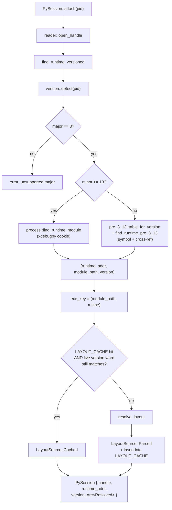
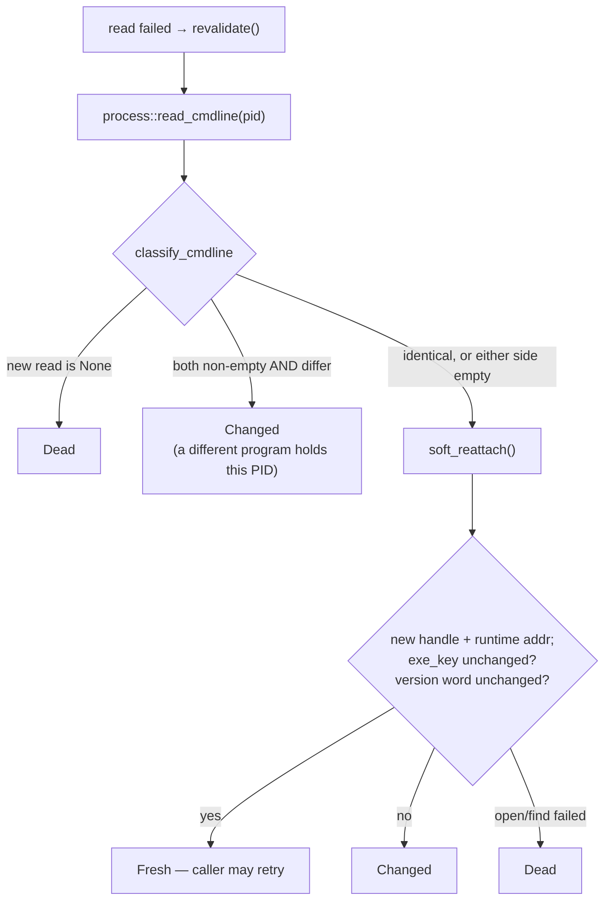
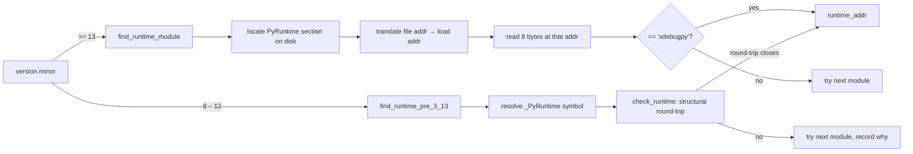
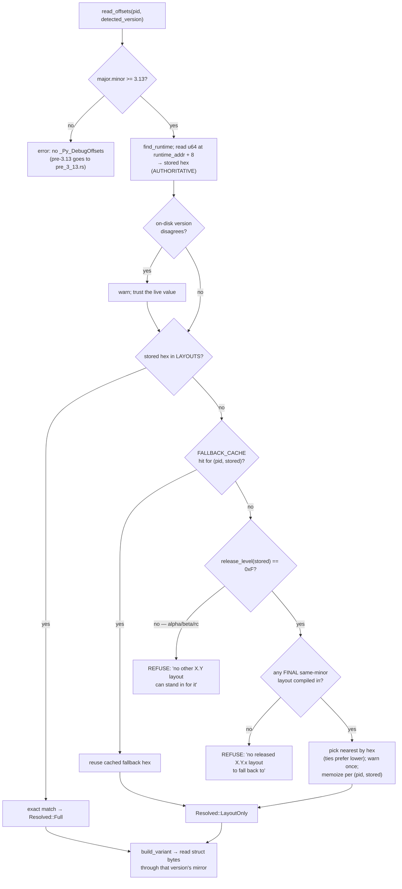
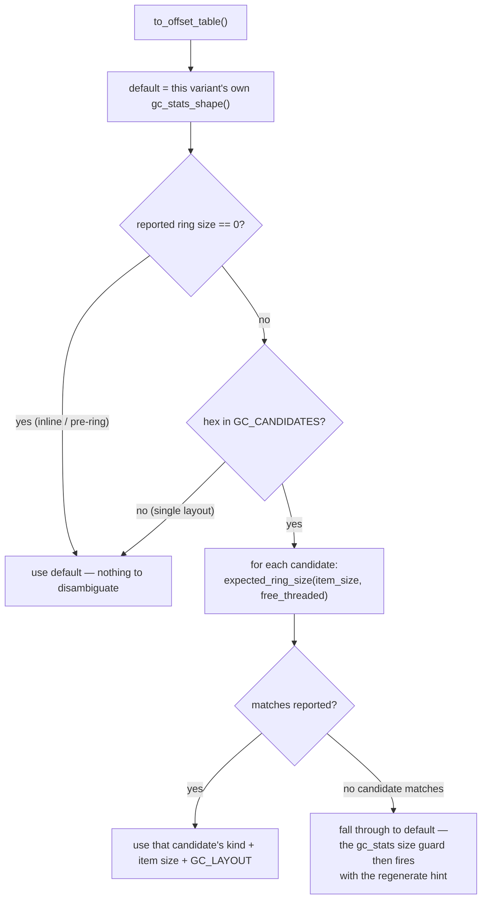
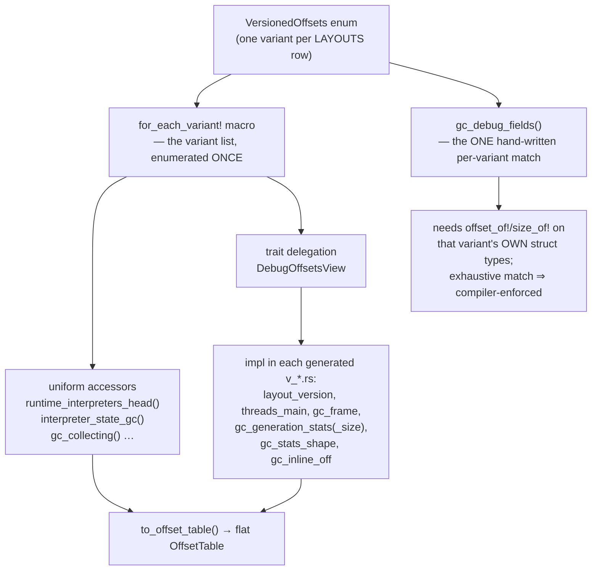

# CPython version support (3.8 – 3.16)

gcscope attaches to a running CPython process and reads its GC state without a
debugger and without executing code inside the target. This requires the byte
offset of every field it walks, and those offsets change with each CPython minor
version and sometimes within a pre-release cycle.

This document covers version detection, `_PyRuntime` location, offset-layout
selection, GC-statistics decode, and the validation guards, for all supported
versions.

A wrong struct offset fails open: it reads a different word of mapped memory and
returns a plausible number, executing the same code path a correct offset does.
Unit tests cannot distinguish the two cases. The exact-or-refuse fallback rule,
the `"xdebugpy"` cookie, the ring-size guard, and the live CI matrix exist to
constrain this failure mode.

Every section stating concrete numbers ends with a `Source:` line. Those files are
authoritative; this document restates what the code computes and can drift.

---

## Contents

1. [Support matrix](#1-support-matrix)
2. [Attach pipeline](#2-attach-pipeline)
3. [Locating `_PyRuntime`](#3-locating-_pyruntime)
4. [Selecting the offset layout](#4-selecting-the-offset-layout)
5. [Offset sources](#5-offset-sources)
6. [Validation guards](#6-validation-guards)
7. [Reading GC stats](#7-reading-gc-stats)
8. [Per-version capabilities](#8-per-version-capabilities)
9. [Verification and adding a version](#9-verification-and-adding-a-version)

---

## 1. Support matrix

| Target | `_PyRuntime` anchor | Offset source | `Resolved` tier | GC stats kind | TUI |
|---|---|---|---|---|---|
| 3.8 | `_PyRuntime` symbol + cross-ref | hardcoded `pre_3_13.rs` | `Legacy` | `InlineArray`, global GC | GC-only view |
| 3.9 – 3.12 | `_PyRuntime` symbol + cross-ref | hardcoded `pre_3_13.rs` | `Legacy` | `InlineArray`, per-interpreter | GC-only view |
| 3.13.x | `"xdebugpy"` cookie | bindgen `v_3_13_*.rs` | `Full` (registered micro) / `LayoutOnly` | `InlineArray` @ `0x80` | full |
| 3.14.x | `"xdebugpy"` cookie | bindgen `v_3_14_4.rs` | `Full` / `LayoutOnly` | `InlineArray` @ `0x78` | full |
| 3.15.0a8 | `"xdebugpy"` cookie | bindgen `v_3_15_0a8.rs` | `Full` | `RingBuffer`, 96-byte entries | full |
| 3.15.0b1 / b3 / b4 | `"xdebugpy"` cookie | bindgen `v_3_15_0b*.rs` | `Full` | `RingBuffer`, 64-byte entries | full |
| 3.15.0b1 `+inc` | `"xdebugpy"` cookie | bindgen `v_3_15_0b1_gcinc.rs` | `Full` | `RingBuffer`, 208-byte entries | full |
| 3.16.0a0 (dev) | `"xdebugpy"` cookie | bindgen `v_3_16_0a0.rs` | `Full` | `RingBuffer`, 64-byte entries | full |
| unregistered final 3.13+ patch | `"xdebugpy"` cookie | nearest final same-minor layout | `LayoutOnly` + warning | as that layout | full |
| unregistered pre-release 3.13+ | — | — | refused | — | — |
| 3.7 and older, or 4.x | — | — | refused | — | — |

### 1.1 Registered layouts

`LAYOUTS` is the list of compiled `_Py_DebugOffsets` layouts, one row per version
hex. Each row's closure reads the target's struct bytes through that build's
generated Rust mirror.

| Version hex | Version | Module | Named sub-structs | Validate/Display tier |
|---|---|---|---|---|
| `0x030d01f0` | 3.13.1 | `v_3_13_1.rs` | 15 | basic |
| `0x030d0df0` | 3.13.13 | `v_3_13_13_53e07256802.rs` | 15 | basic |
| `0x030e04f0` | 3.14.4 | `v_3_14_4.rs` | 19 | basic |
| `0x030f00a8` | 3.15.0a8 | `v_3_15_0a8.rs` | 20 | basic |
| `0x030f00b1` | 3.15.0b1 | `v_3_15_0b1.rs` | 21 | full |
| `0x030f00b3` | 3.15.0b3 | `v_3_15_0b3.rs` | 21 | full |
| `0x030f00b4` | 3.15.0b4 | `v_3_15_0b4.rs` | 21 | full |
| `0x031000a0` | 3.16.0a0 | `v_3_16_0a0.rs` | 21 | full |

`0x030f00b1` additionally carries a same-hex GC candidate: the GC-instrumented
`gc-gen-3.15+inc` fork, via `v_3_15_0b1_gcinc.rs`. Both builds publish the same
`PY_VERSION_HEX` and a byte-identical `_Py_DebugOffsets`, and differ only in the
per-entry `gc_generation_stats` struct (64 vs 208 bytes). They are distinguished at
read time by the ring size the process publishes; see
[§4.2](#42-same-hex-candidates-clean-vs-instrumented-builds).

Pre-3.13 has no registry. `pre_3_13::table_for_version(major, minor)` matches
`(3, 8) … (3, 12)` and returns `None` otherwise.

### 1.2 Version hex encoding

```
(major << 24) | (minor << 16) | (micro << 8) | (release_level << 4) | serial

release_level:  0xA = alpha   0xB = beta   0xC = rc   0xF = final

0x030f00b4  =  3 . 15 . 0 b4        0x030d01f0  =  3 . 13 . 1  (final)
```

*Source:* `src/remote_debugging/offsets/mod.rs` (`LAYOUTS`, `GC_CANDIDATES`),
`src/remote_debugging/offsets/pre_3_13.rs` (`table_for_version`),
`src/remote_debugging/version.rs` (`PythonVersion::from_hex`).

---

## 2. Attach pipeline

All analysis commands (`gc-stats`, `monitor`, `run`, `tui`, `list-pids`) go through
`PySession::attach`, which resolves a process's immutable facts once and serves
subsequent reads from a single held handle.



`attach` is the only caller of `find_runtime`, `version::detect`, and
`read_offsets`. A new command calls `attach` and matches on `Resolved`.

### 2.1 Version detection

`version::detect(pid)` runs two passes over every mapped module whose path contains
`python` (case-insensitive):

1. **Symbol pass (authoritative).** Resolve the `Py_Version` symbol from the
   on-disk image's symbol table, then read `PY_VERSION_HEX` at that address from
   live process memory — 8 bytes first, then 4 as a fallback. The first result with
   `major == 3` wins.
2. **String-scan pass (fallback).** If no module yielded a symbol, scan the image's
   read-only data section — PE `.rdata`, ELF `.rodata`, Mach-O `__TEXT,__cstring` —
   for an embedded `PY_VERSION` literal, falling back to the whole image if that
   section cannot be located.

`Py_Version` was added to the C API in **CPython 3.11**. On 3.8 – 3.10 the symbol
does not exist, so those targets always resolve through the string-scan pass; it is
the only detection path they have. The two passes are otherwise version-blind —
`detect` tries the symbol on every module regardless of version and falls through on
absence — so a stripped symbol table on any version degrades to the same fallback.

The scanner accepts `3.<minor>.<micro>[a|b|rc<serial>]` only when:

- the `3` is not preceded by a digit (otherwise `lib13.12.0` parses as a version);
- a micro component is present (a bare `"3.1 "` must not shadow a `"3.10.4"` later
  in the same section);
- the next byte is a terminator (`NUL`, space, `(`, `"`, `\n`, `\r`, `\t`).

Each component accumulates into a `u8` with checked arithmetic, so `3.999.0`
returns `None` rather than wrapping.

For 3.13+ the detected version selects the finder only. The authoritative version
is the `_Py_DebugOffsets.version` word read from the live process in §4. On
disagreement — an in-place upgrade of a running process, or a string-scan mis-hit —
gcscope warns and uses the live value.

*Source:* `src/remote_debugging/version.rs` (`detect`, `scan_for_version_string`,
`resolve_symbol_in_bytes`).

### 2.2 Module discovery and image base

`binary::find_python_modules` walks the target's mapped regions and keeps every
mapping whose backing file path contains `python`, recording `(path, base_addr)`
for the first mapping of each distinct path.

The base address is platform-specific:

- **ELF / PE** — the first mapping is the load base; section addresses rebase off
  it.
- **macOS** — the kernel attributes several unrelated low-address reservations to
  the image path, so the first mapping is typically a no-access `---` range roughly
  14 MB below the real image. The Mach-O header sits at the start of `__TEXT`,
  which is the executable mapping, and section `vmaddr` values are relative to it.
  macOS therefore skips non-executable mappings (`cfg`-gated; ELF/PE unchanged).

A wrong base lands the read inside some mapped region, so it succeeds and returns
garbage. The cookie is the only check that catches it; see
[§3.3](#33-per-platform-image-facts).

*Source:* `src/memory/binary.rs` (`find_python_modules`).

### 2.3 Child-process search

`search_pid_and_children` tries the given PID first, then recurses into child
processes up to `MAX_DEPTH = 3`.

This handles venv launchers: a Windows redirector `python.exe` execs the real
interpreter as a child, whose `_PyRuntime` lives in a different address space. A
single-shot attach on the launcher PID finds nothing.

Known gap: `search_pid_and_children` returns `(addr, path)` and drops the child PID
it found them in, so it can locate a runtime it cannot then read — the session's
handle remains open on the parent. Target the child PID directly; `list-pids`
surfaces the tree. Plan of record: `docs/venv-launcher-child-retarget.md`.

*Source:* `src/memory/process.rs` (`search_pid_and_children`, `get_child_pids`).

### 2.4 Layout cache

A resolved layout is a pure function of the binary — `to_offset_table` reads only
the already-read struct, never live memory — so it is cached process-wide, keyed by
`(module path, mtime)`, and shared across every PID running that binary.

| | Scope | Evicted by |
|---|---|---|
| Instance state — handle, `runtime_addr`, per-entry freshness | one PID | `mark_died` (single site) |
| Layout — `Arc<Resolved>` | one `(path, mtime)` | never; survives process death |

The multi-MB goblin parse therefore happens once per binary rather than once per
PID, which is what makes a relaunch, a sibling worker process, or a multiprocessing
pool cheap.

Two backstops:

- On a cache hit, `layout_still_valid` re-reads the live `_Py_DebugOffsets` version
  word at `runtime_addr + 8` (3.13+) and requires it to equal the one the cached
  layout was resolved from. Pre-3.13 has no such word, so `(path, mtime)` identity
  is the whole guarantee.
- The layout key must be the interpreter/libpython module, not `argv[0]`, or every
  embedding application gets a cache entry keyed on the wrong file.

`PySession::layout_source()` reports `Parsed` vs `Cached`, which lifecycle tests use
to observe the fast path.

### 2.5 Reused PIDs — `revalidate`

On a failed read the session does not retry (that decision belongs to the caller's
`WaitPolicy`). It calls `revalidate`, which returns `Fresh` / `Changed` / `Dead`:



An empty command line is treated as unknown rather than as a difference.
`read_cmdline` returns `Some("")` when the OS still has the process but its command
line cannot be read — a transient access failure, or a process caught mid-teardown,
which is when `revalidate` runs. `Changed` requires both sides non-empty and
differing.

On Windows this also requires asking sysinfo explicitly for `cmd`;
`refresh_processes` alone leaves it empty there, which made the check compare `""`
against `""`.

*Source:* `src/remote_debugging/session.rs` (`attach`, `revalidate`,
`classify_cmdline`, `soft_reattach`, `layout_still_valid`).

---

## 3. Locating `_PyRuntime`

CPython 3.13 added the `"xdebugpy"` cookie inside `_Py_DebugOffsets`, in a dedicated
`PyRuntime` section, as part of PEP 768. Earlier versions have neither, so runtime
finding splits by version.



### 3.1 3.13+ — cookie path

For each Python module: read it off disk, classify the format, find the `PyRuntime`
section, translate to a load address, and read 8 bytes there.

Section names differ per format. CPython's `GENERATE_DEBUG_SECTION` macro emits
`section("." #name)` on Linux only, and PE truncates section names to 8 characters.

| Format | Section name | Load-address translation |
|---|---|---|
| ELF | `.PyRuntime` (undotted also accepted) | `base + (sh_addr - elf_load_bias)` |
| PE | `PyRuntim` (8-char truncation) | `base + virtual_address` |
| Mach-O | `PyRuntime`, in `__DATA` / `__DATA_CONST` / `__AUTH_CONST` | `base + (sect.addr - __TEXT.vmaddr)` |

`validate_cookie` then compares those 8 bytes against `b"xdebugpy"`. This
comparison is the only confirmation that the address is correct, and the only check
that catches an image-base or fat-slice mistake.

### 3.2 Pre-3.13 — symbol + cross-reference path

The anchor is the `_PyRuntime` symbol plus a structural confirmation:

1. Resolve `_PyRuntime` from the module's symbol table (`resolve_symbol_in_bytes`,
   dispatching on format).
2. Read a window of the runtime — `runtime_interpreters_head + 64` bytes, since
   pre-3.13 has no `runtime_state.size` — and treat every 8-byte word as a candidate
   `PyInterpreterState*`.
3. For each candidate, run the round-trip:

```
candidate  ──(+ interp_threads_head)──►  *  ──►  tstate
tstate     ──(+ thread_interp)────────►  *  ──►  interp
                            interp == candidate ?
```

4. A candidate that closes the round-trip must also equal the pointer stored at
   `runtime_addr + runtime_interpreters_head`. Only then is the runtime accepted.

Every candidate address is checked against the process's mapped regions before any
read.

The heuristic is internal-only: it is not exposed as a `--verify` flag, a `V`
column, or a TUI verify path, and it is not used to validate a 3.13+ same-minor
fallback layout. Its sole caller is `find_runtime_pre_3_13`.

Failures are reported per module and distinguish the two causes — "no `_PyRuntime`
symbol" versus "symbol found at `0x…` but the cross-reference disagreed" — because
they have different fixes (an absent or differently-decorated symbol table, versus
wrong field offsets for this build), and a collapsed message makes a CI failure
undiagnosable from its output. This distinction located the Mach-O fat-slice defect
in §3.3.

A blind data-segment scan was designed as a fallback for a platform that strips the
symbol. The live matrix confirmed `_PyRuntime` is exported on ELF, PE, and Mach-O,
so it is not built.

### 3.3 Per-platform image facts

The first live run of the three-OS matrix failed every non-Windows leg on five
defects, none version-related. Each assumed a PE-shaped fact was universal.

| # | Fact | Fails | Detection |
|---|---|---|---|
| 1 | ELF section is `.PyRuntime`, dotted | closed | the 3.13+ cookie path had never worked on Linux |
| 2 | macOS Python ships `universal2` — offset 0 is a fat header | closed | `MachO::parse(bytes, 0)` failed outright at all three call sites |
| 3 | Mach-O underscore-prefixes C symbols (`__PyRuntime`, `_Py_Version`) | closed | symbol lookups returned nothing |
| 4 | A fat slice must be cut out and parsed at offset 0 | silently | a slice's internal file offsets (`symtab.symoff`, `sect.offset`) are slice-relative; parsing in place read the symbol table out of the wrong slice and returned no symbols, indistinguishable from a stripped binary. Only symbol-driven paths broke while address-driven ones stayed green, and that split coincides with the 3.13 boundary, so a format bug presented as a version bug. |
| 5 | The macOS image base is the first executable mapping, not the first mapping | open | the wrong base still pointed into a mapped `rw-` region, so reads succeeded and returned garbage; only the `"xdebugpy"` cookie caught it |

Resulting rule: platform image facts are discovered and CI-verified, not inferred
from the format spec. All Mach-O parsing goes through `binary::parse_macho`, which
selects the host-architecture slice, cuts it out, and parses it at offset 0,
returning the image and the slice's start offset. Callers using virtual addresses
ignore the offset; callers using file offsets add it.

Two fixes remain correct-but-inferred:

- `parse_macho` selects the slice by `cfg!(target_arch)` — gcscope's architecture,
  not the target's. A universal2 Python under Rosetta read by an arm64 gcscope picks
  the wrong slice and computes a wrong address silently. The correct key is the
  target process's architecture.
- "First executable mapping is the base" holds because `__TEXT` is `r-x` and carries
  the header. The rigorous source is dyld (`task_dyld_info`).

*Source:* `src/memory/process.rs` (`find_section_in_*`, `validate_cookie`,
`find_runtime_pre_3_13`), `src/memory/binary.rs` (`parse_macho`,
`find_python_modules`, `elf_load_bias`), `src/remote_debugging/check_interpreter.rs`,
`src/remote_debugging/version.rs` (`resolve_symbol_*`),
[ADR 0002](adr/0002-version-split-runtime-finding.md),
[ADR 0004](adr/0004-per-platform-image-layout.md).

---

## 4. Selecting the offset layout

For 3.13+ the target publishes its own offsets: `_Py_DebugOffsets` is a struct of
`uint64_t` field offsets that CPython emits into the binary. gcscope reads those
bytes out of the process and casts them through a compiled Rust mirror of the same
struct. The question is which struct definition to read the bytes through; a wrong
choice shifts every field and fails open.



### 4.1 Exact-or-refuse fallback

Within a released line — 3.15.0, 3.15.1, 3.15.2 — the structs `_Py_DebugOffsets`
describes are ABI-frozen by CPython's stability rule, so any final same-minor layout
describes the target correctly and the substitution is safe.

Within a pre-release cycle they are not frozen:

- 3.15.0b1 shrank `gc_generation_stats` from 96 bytes to 64.
- 3.15.0b4 inserted `last_profiled_frame_seq` into `_thread_state`, shifting every
  later field by 8 bytes.

An alpha/beta/rc with no exact layout is therefore refused, and a final build does
not borrow a pre-release layout either (3.15.0 final may differ from 3.15.0rc1; only
an exact entry could establish otherwise).

The rule replaced a micro-distance-only fallback metric. Every 3.15 pre-release ties
at micro 0, so the first registry row won: `3.15.0a8`, whose `gc_generation_stats` is
96 bytes against b1+'s 64. A 3.15.0b4 target decoded through it reported garbage
while every CI leg stayed green. Reordering the candidates was not a fix, since b4's
inserted field means no neighbouring layout fits.

The fallback resolution and its warning are memoized in `FALLBACK_CACHE` keyed by
`(pid, stored hex)`, so a monitor polling at 100 Hz warns once.

### 4.2 Same-hex candidates: clean vs instrumented builds

Two builds can report the same `PY_VERSION_HEX` with a byte-identical
`_Py_DebugOffsets` and differ only in the per-entry `gc_generation_stats` struct.
This is the case for clean 3.15.0b1 versus the `gc-gen-3.15+inc` fork (extended GC
instrumentation, 208-byte entries), which does not bump `patchlevel.h`.

Since the navigation struct is identical, one `VersionedOffsets` variant serves
both, and only the GC shape needs choosing. The single discriminator visible from
outside the process is the ring byte-size published in `gc.generation_stats_size`.



Invariant: candidates registered under one hex must have distinct expected ring
sizes under both the GIL and free-threaded geometries. Two candidates with the same
ring size cannot be distinguished out-of-process and would mis-decode silently. A
unit test enforces this; a colliding pair must be dropped rather than ordered.

A hex absent from `GC_CANDIDATES` skips selection entirely.

*Source:* `src/remote_debugging/offsets/mod.rs` (`read_offsets`,
`resolve_fallback_layout`, `FALLBACK_CACHE`, `GC_CANDIDATES`, `select_gc_shape`,
`expected_ring_size`), [ADR 0006](adr/0006-layout-registration-integrity.md).

---

## 5. Offset sources

### 5.1 Bindgen-generated structs (3.13+)

`scripts/gen-offsets.py` builds a `#[repr(C)]` Rust mirror of the C
`_Py_DebugOffsets` type for one CPython checkout.

```
CPython checkout
      │
      ▼
gen-offsets.py ──► reads patchlevel.h  →  PY_VERSION_HEX
      │
      ├─ 3.14+ : #include "pycore_debug_offsets.h" in a wrapper header
      │
      └─ 3.13.x: pycore_debug_offsets.h does not exist — the struct lives
                 inside pycore_runtime.h, and parsing that whole header would
                 drag in dozens of internal deps. The script extracts just
                 the _Py_DebugOffsets struct text and wraps it standalone:
                     typedef unsigned long long uint64_t;
                     #define _Py_NONSTRING
                     #define _Py_Debug_Cookie "xdebugpy"
                     #pragma pack(push, 8)
                     …pasted struct…
                     #pragma pack(pop)
      │
      ▼
   wrapper.h  ──► bindgen resolves the layout and emits a Rust struct
      │           with compile-time offset_of! / size_of! assertions
      ▼
 v_<version>.rs
```

Each generated module is self-contained and carries:

| Item | Description |
|---|---|
| `_Py_DebugOffsets` + `_Py_DebugOffsets__*` | the `#[repr(C)]` mirror, one named sub-struct per section |
| `const _: () = { … }` blocks | bindgen's compile-time size/offset assertions |
| `gc_generation_stats` | this build's per-entry GC struct |
| `GC_ITEM_SIZE` | `size_of::<gc_generation_stats>()`, computed |
| `GC_LAYOUT` | `GcItemLayout` mapping field name → `offset_of!` within one entry |
| `GC_STATS_INLINE_OFF` | inline-array builds only (3.13 = `0x80`, 3.14 = `0x78`) |
| `impl DebugOffsetsView` | every offset that varies by build, plus `gc_stats_shape()` |
| `// gcscope-source: <repo>@<40-sha>` | provenance, on builds generated from a non-release commit |
| `validate_offsets` / `Display` | full tier only |

At runtime `read_struct::<T>` reads exactly `size_of::<T>()` bytes from the target
and casts them through the mirror with `unsafe std::ptr::read`. Reordering a field
in a generated file is not a compile error, so these files must be regenerated
rather than edited.

#### Basic vs full tier

The generated macros `impl_display_debug_offsets!` and
`impl_validate_debug_offsets!` take one positional type argument per nested
sub-struct, so they apply only to builds with at least the 21 sub-structs they
expect. The generator counts named sub-structs and selects:

- **≥ 21 → full tier.** Generated `validate_offsets` (per-section size checks and
  `field + 8 <= size` bounds checks for every field) and a generated `Display` hex
  dump. Current members: 3.15.0b1, b3, b4, 3.16.0a0.
- **< 21 → basic tier.** `validate_basic` (cookie + version word) and
  `fmt_debug_offsets_basic`, provided by `mod.rs`, with the type added to the
  `impl_basic_display!` / `impl_basic_offsets!` lists. Current members: 3.13.1,
  3.13.13 (15 sub-structs), 3.14.4 (19), 3.15.0a8 (20).

The tier reflects what the build's struct can support. Basic-tier builds are fully
supported for reads.

### 5.2 Hardcoded tables (3.8 – 3.12)

`_Py_DebugOffsets` did not exist before 3.13, so these offsets were extracted from
CPython headers by hand. Each version supplies nine numbers; the other ~20
`OffsetTable` fields are identical across all five and come from a shared
constructor.

| | 3.8 | 3.9 | 3.10 | 3.11 | 3.12 |
|---|---|---|---|---|---|
| `runtime_interpreters_head` | `0x20` | `0x20` | `0x20` | `0x28` | `0x28` |
| `interp_next` | `0x00` | `0x00` | `0x00` | `0x00` | `0x00` |
| `interp_id` | `0x10` | `0x18` | `0x18` | `0x30` | `0x08` |
| `interp_threads_head` | `0x08` | `0x08` | `0x08` | `0x10` | `0x48` |
| `interp_gc` | — | `0x268` | `0x268` | `0x288` | `0x70` |
| `thread_interp` | `0x10` | `0x10` | `0x10` | `0x10` | `0x10` |
| `gc_generations` | `0x18` | `0x18` | `0x18` | `0x18` | `0x18` |
| `runtime_gc` | `0x158` | — | — | — | — |

- 3.10 reuses 3.9 verbatim; `v3_10` calls `v3_9`.
- 3.11 moved `threads.head` and `id`.
- 3.12 nested `threads.head` deeper and moved `id` to `0x08`.
- 3.8 is the only build with global GC state: its `_gc_runtime_state` lives in
  `_PyRuntime` (`runtime_gc = 0x158`) rather than per-interpreter, so `interp_gc` is
  `None`. `OffsetTable::has_global_gc()` — `interp_gc.is_none() &&
  runtime_gc.is_some()` — is the single predicate for this case, and the one thing
  to delete when 3.8 support is dropped.

Shared across all five: `GC_STATS_INLINE_OFF = 0x80`, `GC_ITEM_SIZE = 24`,
`GC_ENTRIES = [1, 1, 1]`, `GC_BASES = [0, 24, 48]`, `GC_COLLECTING = 0xC8`, and
`LEGACY_GC_LAYOUT` = `collections@0`, `collected@8`, `uncollectable@16`.

The nine varying offsets are passed positionally into the constructor, as a compact
table of magic numbers with aligned trailing comments. A named-field struct would
make a transposition compiler-checkable; that tradeoff is not taken because any
transposition is caught end-to-end by the 3.8–3.12 live-smoke legs, and the aligned
table is clearer for hand-extracted offsets. Revisit if the live coverage narrows.

### 5.3 The `VersionedOffsets` abstraction

`VersionedOffsets` is an enum with one variant per registered layout.
Version-specific behavior lives in exactly two places:



- Uniform accessors — fields present on every version — fan out through
  `for_each_variant!`, which lists the variants once. Adding a version adds one arm.
- Divergent accessors delegate to `DebugOffsetsView`, whose impl is emitted into the
  generated file. A field a version lacks returns `0` / `None` there, so call sites
  never branch on version.
- `gc_debug_fields()` is the exception. It computes the `gc` sub-struct's field
  offsets from each build's own types via `offset_of!` / `size_of!`, which a macro
  cannot fan out, and powers the TUI's GC-state subtree. Its `match` is exhaustive,
  so a new version fails to compile until it adds an arm.

The `gc` sub-struct is append-only across CPython versions — `size@0`,
`collecting@8`, `frame@16`, `generation_stats_size@24`, `generation_stats@32` — so a
version has a field iff its `gc` sub-struct is large enough to contain it (16 bytes
on 3.13/3.14, 40 on 3.15+). One `build(gc_off, gc_size)` helper therefore serves
every arm.

`to_offset_table()` flattens this into the version-agnostic `OffsetTable` that
consumers use.

*Source:* `src/remote_debugging/offsets/mod.rs` (`for_each_variant!`,
`DebugOffsetsView`, `gc_debug_fields`, `to_offset_table`),
`src/remote_debugging/offsets/pre_3_13.rs`,
`src/remote_debugging/offsets/v_*.rs`, `scripts/gen-offsets.py`.

---

## 6. Validation guards

Because a wrong layout fails open, each guard below is individually the only check
standing between a mis-resolution and a reported number.

| Guard | Where | Catches | On failure |
|---|---|---|---|
| `"xdebugpy"` cookie | `process::validate_cookie` | wrong image base, wrong fat slice, wrong section translation, non-Python module | module rejected, next one tried |
| interpreter cross-reference round-trip | `check_interpreter::check_runtime` | wrong pre-3.13 `_PyRuntime` candidate, or wrong field offsets for this build | candidate rejected; per-module reason recorded |
| cookie + version-word check | `validate_basic` (basic tier) | bytes decoded through the wrong struct | reported as a failed check by `read-runtime` |
| per-section `size != 0` + `field + 8 <= size` bounds | generated `validate_offsets` (full tier) | a field offset that would read another section's bytes; a section never populated | reported per-check |
| pre-release exact-or-refuse | `resolve_fallback_layout` | approximating an alpha/beta/rc from a neighbouring layout | hard error naming the version and pointing at `gen-offsets.py` |
| final-never-borrows-pre-release | `resolve_fallback_layout` | 3.15.0 final decoded through a 3.15 beta layout | hard error |
| ring-size mismatch | `PySession::verify_ring_stats_size` | published `gc.generation_stats_size` disagreeing with the compiled geometry — wrong entry stride or wrong field offsets | hard error with a regenerate hint |
| distinct candidate ring sizes | `gc_candidates_have_distinct_ring_sizes` (test) | two same-hex candidates indistinguishable out-of-process | test failure |
| every `LAYOUTS` row builds its own version | `every_layouts_row_builds_its_own_version` (test) | a copy-pasted registry row that keeps the previous variant | test failure |
| ring geometry written twice stays in sync | `expected_ring_size_agrees_with_set_ring` (test) | selection picking a layout the decoder then reads with different bases | test failure |
| at most one `ONGOING` layout registered | `scripts/gen-offsets.py` | two drifting dev snapshots, for which there is no oracle | generation refused |
| `--suffix` build's `_Py_DebugOffsets` byte-identical to the nav variant's | `scripts/gen-offsets.py` | a same-hex candidate registered against a drifted base | generation refused, naming the differing sub-struct |

The `LAYOUTS` row is the one registration step the compiler cannot enforce. The enum
variant, the `for_each_variant!` arm, the `gc_debug_fields` arm, and the
`validate`/`Display` arms all fail to build if omitted. A copy-pasted `LAYOUTS` row
that keeps the previous variant compiles cleanly and then decodes live processes
through the wrong struct. `every_layouts_row_builds_its_own_version` covers this: it
constructs every registered variant from a zeroed buffer in gcscope's own address
space and asserts each reports the hex its row is keyed on. This works because the
generated `layout_version()` is a hardcoded constant that never reads `self` — the
same self-read capability that makes `-1` targeting possible.

The ring-size guard is version-independent. `attach` has already selected the
best-matching layout, so for a recognized build the reconstructed size equals the
reported one and the check is silent. A mismatch means the entry stride or the field
offsets are wrong and every decoded number would be garbage. It fires on every OS,
for any future mid-cycle struct change, with no new test, and would have caught the
3.15.0b4-through-a8 mis-decode on day one.

*Source:* `src/remote_debugging/offsets/validation.rs`,
`src/remote_debugging/offsets/mod.rs` (registry + candidate tests),
`src/remote_debugging/session.rs` (`verify_ring_stats_size`),
`scripts/gen-offsets.py`.

---

## 7. Reading GC stats

### 7.1 The pointer walk

Every version reaches the stats the same way; only the last hop differs.

```
_PyRuntime
   │
   └─(+ runtime_interpreters_head)──► interp_head ──(+ interp_next)──► … (chain)
                                          │
                        ┌─────────────────┴──────────────────┐
                        │                                    │
              3.9+ per-interpreter                   3.8 global GC
        gc_addr = interp + interp_gc          gc_addr = _PyRuntime + runtime_gc
                        └─────────────────┬──────────────────┘
                                          ▼
                             OffsetTable::gc_stats_region(gc_addr, …)
                                          │
              ┌───────────────────────────┼───────────────────────────┐
              ▼                           ▼                           ▼
  Direct(gc_addr + inline_off)   Deref(gc_addr + gc.generation_stats)  Absent
        InlineArray                    RingBuffer                    kind None,
       (3.8 – 3.14)                    (3.15.0a8+)                 or unresolved
                                                                   pointer field
```

`gc_state_addr` and `gc_stats_region` are pure address arithmetic with no process
access, which makes this logic unit-testable without a live target. The single read
a `Deref` needs happens in `PySession::gc_stats_region_addr`, the one entry point
used by both the CLI stats loop and the TUI collector. A NULL ring pointer is the
normal "stats not allocated yet / teardown" state and resolves to `None`, skipped
rather than treated as an error.

Sharing that entry point is load-bearing: the CLI (`PySession::gc_stats`) and the
TUI collector (`snapshot::collect`) originally computed the stats address
independently, and when the 3.8 global-GC branch was added to only one of them the
TUI read garbage at `interp_head + 0x80`. Both now route through `gc_state_addr` +
`gc_stats_region_addr`.

Decode branches on kind, not on version, which lets 3.8–3.12 reuse the inline path
with no decode logic of their own.

### 7.2 `InlineArray` — 3.8 through 3.14

One entry per generation, contiguous, at a fixed offset inside `_gc_runtime_state`:

```
gc_addr + gc_stats_inline_off
│
├── 0x00 ┌──────────────────────────────┐  generation 0 (young)
│        │ collections    (Py_ssize_t)  │  +0
│        │ collected      (Py_ssize_t)  │  +8
│        │ uncollectable  (Py_ssize_t)  │  +16
├── 0x18 ├──────────────────────────────┤  generation 1
│        │ collections / collected /    │
│        │ uncollectable                │
├── 0x30 ├──────────────────────────────┤  generation 2 (old)
│        │ collections / collected /    │
│        │ uncollectable                │
└── 0x48 └──────────────────────────────┘  total read: 72 bytes

item_size = 24    entries_per_gen = [1, 1, 1]    bases = [0, 24, 48]
```

The only version-varying number is `gc_stats_inline_off`:

| Build | `gc_stats_inline_off` |
|---|---|
| 3.8 – 3.13 | `0x80` |
| 3.14 | `0x78` |

For 3.13/3.14 it is computed per build by `gen-offsets.py` and emitted as
`GC_STATS_INLINE_OFF` in the generated module; for 3.8–3.12 it is the hand-written
`pre_3_13::GC_STATS_INLINE_OFF`.

The item struct and the inline array position are identical across 3.8–3.13, which
is why pre-3.13 GC support required no new decode logic — only the inline path
3.13/3.14 already used.

### 7.3 `RingBuffer` — 3.15.0a8 and later

3.15 replaced the per-generation counter struct with a ring of recent collection
records, reached through the `gc.generation_stats` pointer. Each generation's ring is
followed by an 8-byte write cursor:

```
*(gc_addr + gc.generation_stats)
│
│ ◄─────────────── generation 0 (young): 11 entries ───────────────►│cursor│
├────────┬────────┬────────┬─────────────────────────┬────────┬─────┬──────┐
│ entry0 │ entry1 │ entry2 │           …             │entry10 │     │ u64  │
└────────┴────────┴────────┴─────────────────────────┴────────┴─────┴──────┘
│                                                                          │
│ ◄──── generation 1: 3 entries ────►│cursor│                              │
├────────┬────────┬────────┬──────┐                                        │
│ entry0 │ entry1 │ entry2 │ u64  │                                        │
└────────┴────────┴────────┴──────┘                                        │
│ ◄──── generation 2: 3 entries ────►│cursor│                              │
├────────┬────────┬────────┬──────┐                                        │
│ entry0 │ entry1 │ entry2 │ u64  │ ◄── the process counts this trailing   │
└────────┴────────┴────────┴──────┘     cursor; the decoder never reads it  │

bases = compute_ring_base_offsets(item_size, entries):
    bases[0] = 0
    bases[1] = entries[0] * item + 8          ← the +8 is the cursor
    bases[2] = bases[1] + entries[1] * item + 8
```

Entry counts depend on the build's threading model:

| Build | `entries_per_gen` |
|---|---|
| GIL | `[11, 3, 3]` |
| free-threaded (`3.15t`) | `[1, 1, 1]` |

Worked example — clean 3.15.0b1, GIL build, 64-byte entries:

```
bases[0] = 0
bases[1] = 11 * 64 + 8                  =  712
bases[2] = 712 + 3 * 64 + 8             =  912

stats_buffer_len()    = bases[2] + entries[2] * item
                      = 912 + 3 * 64    = 1104   ← bytes the decoder reads
gc_stats_region_size()= 1104 + 8        = 1112   ← what the process publishes
```

The two formulas differ by 8 because the process counts generation 2's trailing
cursor and the decoder does not read it. `gc_stats_region_size()` is the value
`verify_ring_stats_size` compares against `gc.generation_stats_size`.

The same arithmetic for the other ring builds:

| Build | item | entries | buffer read | region published |
|---|---|---|---|---|
| 3.15.0b1 / b3 / b4 / 3.16.0a0, GIL | 64 | `[11,3,3]` | 1104 | 1112 |
| 3.15 free-threaded (`3.15t`) | 64 | `[1,1,1]` | 208 | 216 |
| 3.15.0b1 `+inc`, GIL | 208 | `[11,3,3]` | 3552 | 3560 |
| 3.15.0a8, GIL | 96 | `[11,3,3]` | 1648 | 1656 |

1112 ≠ 3560 is what allows the clean and `+inc` builds to share a version hex and
still be distinguished, and 3.15t is a CI leg in its own right because it is the only
build reaching the `[1,1,1]` geometry.

The ring geometry is written twice — in `expected_ring_size` for selection and in
`set_ring` for decoding — so a test asserts they agree. Drift there would select one
layout and decode with another layout's bases, making every stat wrong.

### 7.4 Per-entry fields, by build

The field set an entry carries is a property of the build, so it lives in
`GcItemLayout` (name → byte offset) rather than in Rust struct fields.

| Build | Entry size | Fields |
|---|---|---|
| 3.8 – 3.12 (`LEGACY_GC_LAYOUT`) | 24 | `collections`, `collected`, `uncollectable` |
| 3.13.1 / 3.13.13 / 3.14.4 | 24 | `collections`, `collected`, `uncollectable` |
| 3.15.0a8 | 96 | `ts_start`, `ts_stop`, `heap_size`, `work_to_do`, `collections`, `object_visits`, `collected`, `uncollectable`, `candidates`, `objects_transitively_reachable`, `objects_not_transitively_reachable`, `duration` |
| 3.15.0b1 / b3 / b4 / 3.16.0a0 | 64 | `ts_start`, `ts_stop`, `collections`, `collected`, `uncollectable`, `candidates`, `duration`, `heap_size` |
| 3.15.0b1 `+inc` | 208 | the 8 above, plus `increment_size`, `alive_size`, `finalized_garbage_count`, `clear_weakrefs_count`, `deleted_garbage_count`, and 13 per-phase timestamps (`ts_mark_alive_*`, `ts_fill_increment_*`, `ts_deduce_unreachable_*`, `ts_handle_weakref_callbacks_*`, `ts_finalize_garbage_stop`, `ts_handle_resurrected_stop`, `ts_clear_weakrefs_stop`, `ts_delete_garbage_*`) |

3.15.0a8 → b1 also dropped fields: `work_to_do`, `object_visits`, and the two
`objects_*_transitively_reachable` counters. A layout substitution across that
boundary would misalign fields and report counters that no longer exist.

### 7.5 `GcStat` as a layout-driven view

`GcStat` holds one entry's raw bytes plus its build's `GcItemLayout`, and decodes
fields lazily by name:

```rust
stat.get("collections")        // Option<i64>  — None if this build lacks the field
stat.get_f64("duration")       // Option<f64>  — reinterprets the raw bits
stat.has("increment_size")     // bool
stat.iter_fields()             // (name, offset-within-entry, raw u64) in layout order
```

A field the build lacks reads back `None`, never `Some(0)`. `gc_stats::print_stats`
keys its entire column set on `increment_size.is_some()`, so conflating the two would
change the CLI's output for every pre-3.13 target. Typed convenience accessors
(`collections()`, `collected()`, `ts_start()`, …) exist for the always-present core
and fall back to zero.

This is the single decode primitive used by both the Chrome-trace exporter and the
TUI detail panel, which is why a `+inc` build's 26 fields reach both with no struct
change.

Two shape conditions yield an empty result rather than an error: a build with no
stats geometry, and a `raw` buffer shorter than the shape requires (a plausible
teardown race). A failed read of a stats buffer already determined to exist does
propagate as an error.

*Source:* `src/remote_debugging/offsets/offset_table.rs` (`GcStatsKind`,
`GcStatsRegion`, `gc_state_addr`, `gc_stats_region`, `compute_ring_base_offsets`,
`stats_buffer_len`, `gc_stats_region_size`, `decode_gc_stats`),
`src/remote_debugging/offsets/pre_3_13.rs`,
`src/remote_debugging/offsets/v_*.rs` (`GC_LAYOUT`, `GC_ITEM_SIZE`),
`src/remote_debugging/gc_stats.rs` (`GcStat`),
[ADR 0003](adr/0003-layout-driven-gc-stats-decode.md),
[ADR 0007](adr/0007-gcstat-layout-driven-view.md).

---

## 8. Per-version capabilities

### 8.1 Resolution tiers

`Resolved` is the enum every consumer matches on:

| Tier | Applies to | Carries |
|---|---|---|
| `Full` | 3.13+ with an exact registered hex | `VersionedOffsets` + `OffsetTable` |
| `LayoutOnly` | 3.13+ resolved through a final same-minor fallback | `VersionedOffsets` + `OffsetTable` |
| `Legacy` | 3.8 – 3.12 | `OffsetTable` only |

`Full` and `LayoutOnly` behave identically for reads — the fallback path still reads
a real `_Py_DebugOffsets` struct out of the process. They differ in confidence and in
the one-time warning `LayoutOnly` emits.

### 8.2 Capability matrix

| Capability | 3.8 | 3.9 – 3.12 | 3.13 / 3.14 | 3.15+ |
|---|---|---|---|---|
| `gc-stats` | ✅ (global GC) | ✅ | ✅ | ✅ |
| `monitor` / `run` (Chrome trace) | ✅ | ✅ | ✅ | ✅ |
| `list-pids` `S` column | ✅ | ✅ | ✅ | ✅ |
| TUI — selectable in the PID picker | ✅ | ✅ | ✅ | ✅ |
| TUI — GC-stats view | ✅ | ✅ | ✅ | ✅ |
| TUI — full `_Py_DebugOffsets` struct panels | ❌ | ❌ | ✅ | ✅ |
| Per-collection timing / extended GC fields | ❌ | ❌ | ❌ | ✅ (ring builds) |

The capability predicate is `PySession::supports_gc_stats()`, defined as
`gc_stats_kind != GcStatsKind::None`. Since 3.8–3.12 decode through the same
`InlineArray` path, they report supported, so all of 3.8 → 3.16 are selectable in the
TUI picker and marked supported in `list-pids`. This single predicate replaced an
earlier `Tier` enum.

The TUI's struct panels are the one genuine version gate, since they visualize the
`_Py_DebugOffsets` struct that pre-3.13 lacks. `Legacy` gets a focused GC-stats-only
view.

### 8.3 Attach permissions

| Platform | Requirement |
|---|---|
| Windows | none, for a process you own |
| Linux | same-uid works when the target is a descendant; otherwise loosen Yama: `sudo sysctl -w kernel.yama.ptrace_scope=0` |
| macOS | depends on the target: 3.13+ attaches unprivileged; 3.8–3.12 needs `sudo gcscope …` |

The macOS split comes from the target. Every framework build is signed with a
hardened runtime (`flags=0x10000(runtime)`), but only 3.13+ ships
`com.apple.security.get-task-allow`, which arrived with PEP 768 and is what admits a
same-user caller to the task port. Granting `system.privilege.taskport` does not
change this.

To avoid `sudo`, sign gcscope with `com.apple.security.cs.debugger` (granted by the
repo's `gcscope.entitlements`) — the mechanism LLDB's `debugserver` uses. The
certificate must be trusted for code signing; a self-signed one in the System
keychain works. Ad-hoc `codesign -s -` does not, since restricted entitlements are
ignored on ad-hoc signatures. Re-sign after every build.

*Source:* `src/remote_debugging/session.rs` (`Resolved`, `supports_gc_stats`),
`src/list_pids.rs`, `src/tui/`, `README.md`, `gcscope.entitlements`.

---

## 9. Verification and adding a version

### 9.1 Test layers

Unit tests (`#[cfg(test)]`, in-file, no Python needed, under a second) cover the pure
logic: version hex encoding, the `LAYOUTS` registry's self-consistency, GC-shape
selection, ring and inline geometry, stat decode, monitor dedup, and the
`revalidate` classification.

They cannot catch a wrong struct offset. Such an offset executes the same branches,
the same call graph, and the same covered lines as a correct one, and the difference
lives in another process's memory, so no test input distinguishes them.

The correctness gate is the live matrix: `tests/live_smoke.rs` spawns
`tests/fixtures/spin.py`, attaches with the gcscope binary, and asserts the decoded
shape. A resolution error surfaces as a shape assertion failure on the specific
`(os, version)` leg that depends on it.

### 9.2 CI matrix

| Job | Coverage |
|---|---|
| `live-smoke` | 3 OSes (ubuntu / windows / macos) × `3.8, 3.9, 3.10, 3.11, 3.12, 3.13, 3.14, 3.15, 3.15t` |
| `custom-build-smoke` | Linux, built from source: `3.15+inc` (from `sergey-miryanov/cpython@feat/gc-gen-3.15+inc`) and `3.16.0a0` (from the commit pinned in the layout file) |

Policy details:

- 3.15 is left floating. `setup-python` picks the newest pre-release, and gcscope
  refuses one it has no exact layout for, so these legs go red when a new beta/rc
  ships. Do not pin 3.15 to fix a red leg: regenerate the offsets and register them.
- 3.15t is the only free-threaded leg, and the only build reaching the `[1,1,1]` ring
  geometry.
- 3.16 is omitted from `live-smoke` (absent from the `setup-python` registry) and
  built from source at the commit read out of `v_3_16_0a0.rs`'s `// gcscope-source:`
  line. Regenerating the offsets moves the CI pin with them, with no workflow edit.
- macOS pre-3.13 legs run under root, flagged per version, because the target lacks
  `get-task-allow`. Encoding the split rather than running all of macOS under blanket
  root means a 3.13+ build that stops shipping the entitlement fails instead of being
  masked.

`-1` as the PID targets gcscope's own process, using the same self-read capability
the registry tests rely on.

### 9.3 Adding a version

Full support via bindgen is maintainer-only; building, testing, and running gcscope
need none of it, since the generated `v_*.rs` files are checked in. `gen-offsets.py`
shells out to a `bindgen` binary on PATH rather than depending on a crate.

```powershell
cargo install bindgen-cli --version 0.72
$env:LIBCLANG_PATH = "C:\Program Files\Microsoft Visual Studio\2022\Community\VC\Tools\Llvm\x64\bin"
python scripts/gen-offsets.py X:/path/to/cpython
```

The generator prints an exact registration checklist to stderr, including the tier
the build lands in and the matching arms; follow that rather than this summary. It
comes to roughly nine lines in `offsets/mod.rs`:

1. `mod v_3_xx_y;` declaration
2. a `LAYOUTS` row (hex → `read_struct` closure) — the only site the compiler does
   not enforce
3. a `VersionedOffsets` enum variant
4. a `for_each_variant!` arm (drives most accessors + the trait delegation)
5. a `gc_debug_fields` `match` arm
6. a `validate()` arm — `validate_basic` or the generated `validate_offsets`
7. a `Display` arm — same basic/full split
8. basic tier only: add to `impl_basic_display!` and `impl_basic_offsets!`

Steps 3–8 fail to build if omitted; step 2 is covered by the
`every_layouts_row_builds_its_own_version` test.

For a same-hex second build (a clean release and an instrumented fork sharing a
`PY_VERSION_HEX`):

```powershell
python scripts/gen-offsets.py X:/path/to/cpython-+inc --suffix gcinc
```

This writes `v_<version>_gcinc.rs` instead of clobbering the clean file, and — the
hex being already registered — the checklist prints the same-hex path: a `mod`
declaration plus one `GC_CANDIDATES` row, with no new enum variant, `LAYOUTS` row, or
accessor arms. `cargo test` then enforces distinct ring sizes across the candidates.

Rules:

- Every pre-release needs its own entry; patch releases do not. `_Py_DebugOffsets` is
  ABI-frozen across 3.15.0/3.15.1/3.15.2 but not across a pre-release cycle; see
  [§4.1](#41-exact-or-refuse-fallback).
- At most one `ONGOING` (dev-build) layout may be registered at a time, since two
  drifting `main` snapshots have no oracle for which is current. The generator refuses
  the second.
- A `--suffix` build's `_Py_DebugOffsets` must be byte-identical to the registered nav
  variant's; the generator refuses on drift and names the differing sub-struct.
- Never hand-edit a generated `v_*.rs`. Reordering a field there produces a wrong
  answer rather than a compile error. Regenerate.

The long-form recipe, including the `--stdout` trick for finding a checkout's hex, is
in `README.md` ("Adding a new Python version").

*Source:* `.github/workflows/rust.yml`, `tests/live_smoke.rs`,
`scripts/gen-offsets.py`, `README.md`,
[ADR 0005](adr/0005-testing-strategy.md),
[ADR 0006](adr/0006-layout-registration-integrity.md).

---

## Appendix — where things live

| Concern | File |
|---|---|
| Process handle, raw reads | `src/memory/reader.rs` |
| Mapped regions, module discovery, Mach-O fat handling | `src/memory/binary.rs`, `src/memory/regions.rs` |
| `_PyRuntime` finding (both anchors), child recursion, cmdline | `src/memory/process.rs` |
| Pre-3.13 structural confirmation | `src/remote_debugging/check_interpreter.rs` |
| Version detection, symbol resolution, version-string scan | `src/remote_debugging/version.rs` |
| Layout registry, fallback rules, GC-shape selection, `VersionedOffsets` | `src/remote_debugging/offsets/mod.rs` |
| Hardcoded 3.8–3.12 tables | `src/remote_debugging/offsets/pre_3_13.rs` |
| Generated per-build mirrors | `src/remote_debugging/offsets/v_*.rs` |
| Flat `OffsetTable`, stats geometry + decode | `src/remote_debugging/offsets/offset_table.rs` |
| Layout validation reports | `src/remote_debugging/offsets/validation.rs` |
| `PySession`: attach, cache, revalidate, `gc_stats` | `src/remote_debugging/session.rs` |
| `GcStat` layout-driven view | `src/remote_debugging/gc_stats.rs` |
| Snapshot collection for the TUI | `src/snapshot/` |
| Monitor loop, exporters | `src/monitor/` |
| TUI rendering | `src/tui/` |
| Offset generator | `scripts/gen-offsets.py` |
| Decision records | `docs/adr/` |
